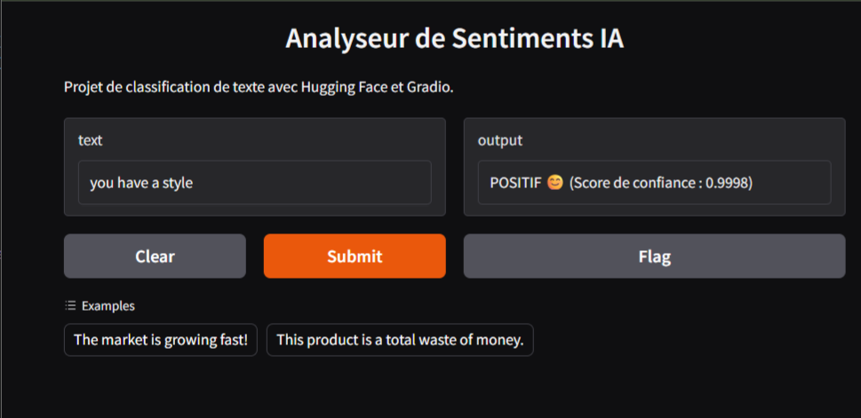

# 📊 IA Sentiment Analyzer

[](https://www.python.org/downloads/)
[](https://127.0.0.1:7860)

Ce projet est un classificateur de sentiments utilisant le modèle de Deep Learning **DistilBERT** via Hugging Face. Il permet d'analyser rapidement le sentiment (Positif/Négatif) d'un texte, comme un avis client ou une news financière.

## 🖥️ Aperçu de l'interface



## 🚀 Caractéristiques
- **Modèle** : DistilBERT-base-uncased-finetuned-sst-2-english
- **Interface** : Gradio (Web UI locale)
- **Frameworks** : Transformers, PyTorch, Gradio

## 🛠️ Installation et Utilisation Locale

```bash
# 1. Cloner le dépôt
git clone [https://github.com/hardinet/sentiment-classifier.git](https://github.com/hardinet/sentiment-classifier.git)
cd sentiment-classifier

# 2. Créer un environnement virtuel
python -m venv .venv
# Sur Windows :
.venv\Scripts\activate

# 3. Installer les dépendances
pip install -r requirements.txt

# 4. Lancer l'application
python app.py